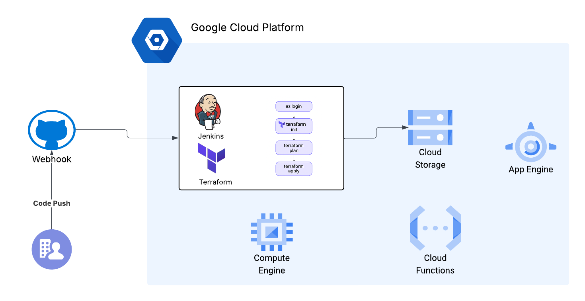
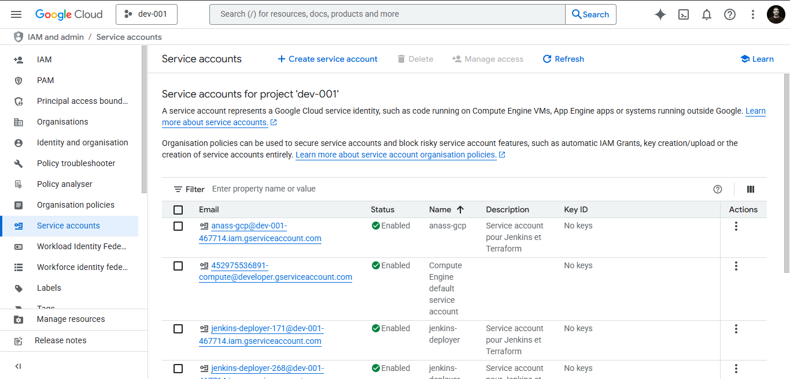
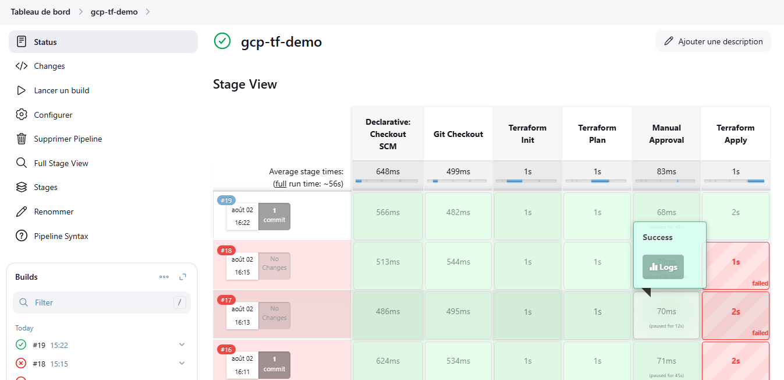

# Automated CI/CD Pipeline for Data Engineering on GCP

This project demonstrates how to build an **automated CI/CD pipeline** using **Jenkins** and **Terraform** on **Google Cloud Platform (GCP)**.  
The pipeline provisions data infrastructure (Cloud Storage, BigQuery) and deploys data pipelines triggered by changes pushed to GitHub.

---

## **Project Structure**

```bash

gcp-dataeng-ci-cd/
├── imgs/
│ ├── Architecture.png
│ ├── gcp.png
│ └── pipeline.png
├── jenkins/
│ └── Jenkinsfile
└── terraform/
└── main.tf


---

## **Architecture**


---

## **How It Works**
1. **GitHub Commit**: Code changes (Terraform configs or data pipeline scripts) are pushed to the repository.  
2. **Jenkins Pipeline**: Defined in `jenkins/Jenkinsfile`, Jenkins triggers Terraform commands to provision/update infrastructure.  
3. **Terraform**: Uses `terraform/main.tf` to create GCP resources:
   - Cloud Storage (Bronze, Silver, Gold)
   - BigQuery datasets
   - Optional Dataflow/Dataproc for transformations.  
4. **Data Pipeline Execution**: Once infrastructure is ready, Jenkins can trigger ingestion and transformation jobs.  

---

## **Images**
- **GCP Services**:   
- **Pipeline Flow**:   

---

## **Setup Instructions**
### 1. Clone the Repository
```bash
git clone https://github.com/your-username/gcp-dataeng-ci-cd.git
cd gcp-dataeng-ci-cd
